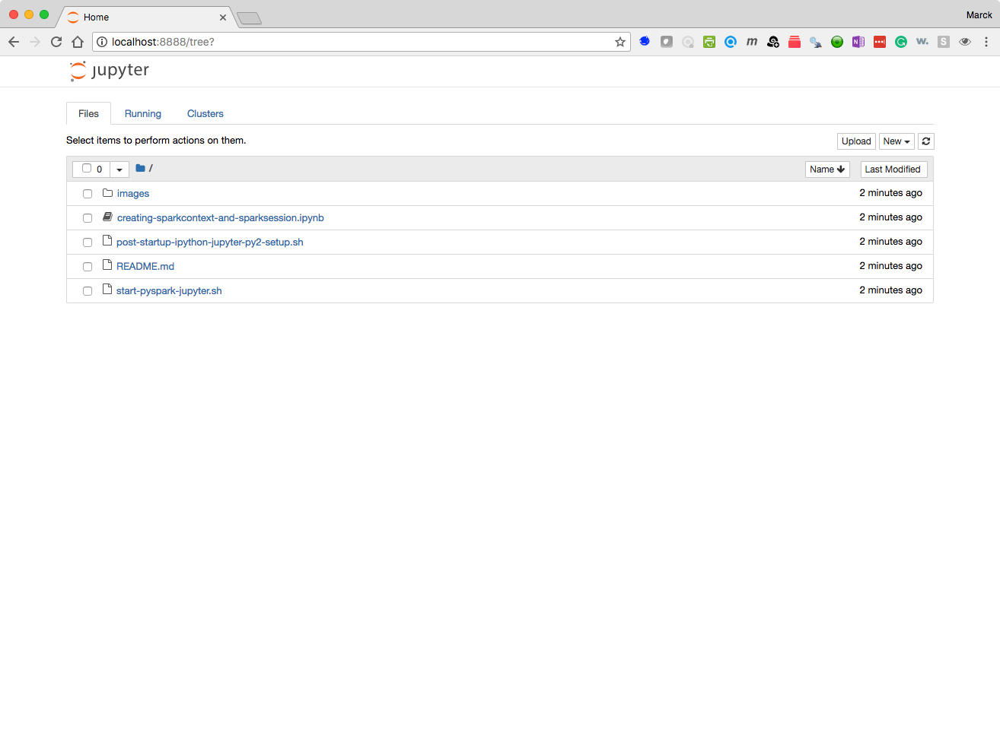

# ANLY502 - Massive Data Fundamentals<br>Lab L07: Spark<br>March 12, 2018

The purpose of this lab is for you to become familiar with Spark and use Python as a means to work with Spark. 

## Start your cluster

Create an EMR cluster with *Advanced Options* and the following configuration:

* Select `emr-5.12.0` from the drop-down
* Click check-boxes for these applications only: Hadoop 2.8.3, Tez 0.8.4, Hive 2.3.2, Spark 2.2.1	
* Click Next
* Edit the instance types and set 1 master and 4 core of m4.xlarge 
* Click Next
* Give the cluster a name, and you can uncheck logging, debugging and termination protection enabled
* Click Next
* Select your key-pair
* Click "Create Cluster"

Once the cluster is in "Waiting" mode (should only take a few minutes), please `ssh` into the master. After you log-in to the master node, run the following commands in your terminal:


```
sudo yum install -y git
git clone https://github.com/gu-anly502/lab07-spring-2018.git
cd lab07-spring-2018
bash post-startup-ipython-jupyter-py2-setup.sh 
```

These commands will install git, clone your repository to the master node of the cluster, and run a script that installs iPython and other Python libraries including pandas, Jupyter and starts a notebook web server. This will take a few minutes (it took about 6 minutes in testing, but your time may vary.) When the script is done you will see something like this:

```


-------------- POST STARTUP SCRIPT COMPLETE ---------------
ipython and Jupyter (running Python 2) are configured.
To access Jupyter notebook, logoff with the exit command
and log back on using agent and port forwarding:
ssh -A -L8888:localhost:8888 hadoop@...
and then open a web browser and go to http://localhost:8888
-----------------------------------------------------------


```
Once this is done, please type `exit` to logoff and then log back on, making sure you enable both ssh-agent forwarding and port forwarding:


```
ssh-add
ssh -A -L8888:localhost:8888 hadoop@...
``` 

You can then open a browser and navigate to http://localhost:8888 to see your Jupyter Notebook environment, which got started within the lab directory you cloned. 



## Using Jupyter Notebooks as the front end to the Spark Cluster

In the script you ran before, the environment was setup such that `pyspark` which is the Python console for Spark gets bound to your Jupyter notebook, and the `SparkSession` object gets created automatically every time you start a notebook. **Note: this works only in the configuration we created.**


Click the New button on the top-right, and select Python 2 from the dropdown. This will start a new blank notebook:

Type `spark` in the first cell, press `Ctrl+Enter`. If you get the following result that means that your notebook is connected to the Spark Cluster using YARN as the resource manager.


### Manually creating the `SparkSession` in Jupyter


Sometimes you may work in environments where that it not the case, so you may want to take a look at the `creating-sparkcontext-and-sparksession.ipynb` notebook by clicking on it, which shows you how to manually start the connection object.

You will see the first cell contains the following code:

```{python}
from pyspark import SparkContext, SparkConf
from pyspark.sql import SparkSession
spark = SparkSession.builder.appName("my-app-name").getOrCreate()
sc    = spark.sparkContext      # get the context
```
Running this cell will create the `SparkContext` and `SparkSession` objects inside your notebook. Please read this notebook to familiarize yourself with `SparkContext` and `SparkSession`


## Lab Exercises

There are three Jupyter Notebooks in the repository. We will quickly discuss in class and then walk through them. These are all about RDD operations:

* `shakespeare.ipynb`
* `quazyilx.ipynb`
* `forensicswiki.ipynb`


## Other Ways to Connect to Spark

There are several other ways to work with spark. We did not talk about them in class and they are here for reference.

### Spark shell (using Scala)

We didn't discuss this much in class. One of the ways to have an interactive session with Spark is by using the spark-shell. This starts an interactive, text based environment where you interact with the cluster using Scala.

Try it out! Type `spark-shell` in the command line. You'll know its Scala because you will see a Scala prompt. You can exit the spark-shell by using the `Ctrl-D` key combination.

```
[hadoop@ip-172-31-62-160 ~]$ spark-shell
Setting default log level to "WARN".
To adjust logging level use sc.setLogLevel(newLevel). For SparkR, use setLogLevel(newLevel).
17/06/27 21:18:02 WARN Utils: Service 'SparkUI' could not bind on port 4040. Attempting port 4041.
17/06/27 21:18:03 WARN Client: Neither spark.yarn.jars nor spark.yarn.archive is set, falling back to uploading libraries under SPARK_HOME.
Spark context Web UI available at http://172.31.62.160:4041
Spark context available as 'sc' (master = yarn, app id = application_1498593832174_0002).
Spark session available as 'spark'.
Welcome to
      ____              __
     / __/__  ___ _____/ /__
    _\ \/ _ \/ _ `/ __/  '_/
   /___/ .__/\_,_/_/ /_/\_\   version 2.1.0
      /_/

Using Scala version 2.11.8 (OpenJDK 64-Bit Server VM, Java 1.8.0_121)
Type in expressions to have them evaluated.
Type :help for more information.

scala>
```

### PySpark shell (regular Python shell)

You can connect to Spark using PySpark, which runs a copy of the Python interpreter that's connected to the Spark runtime. As you can see, you see the Python version. You can exit this shell by typing quit(). If you had not run the scripts you ran after you started the cluster, this is what you would have to use Python with PySpark and Spark. 

```
[hadoop@ip-172-31-30-120 ~]$ pyspark
Python 2.7.13 (default, Jan 31 2018, 00:17:36)
[GCC 4.8.5 20150623 (Red Hat 4.8.5-11)] on linux2
Type "help", "copyright", "credits" or "license" for more information.
Setting default log level to "WARN".
To adjust logging level use sc.setLogLevel(newLevel). For SparkR, use setLogLevel(newLevel).
18/03/12 14:43:52 WARN Client: Neither spark.yarn.jars nor spark.yarn.archive is set, falling back to uploading libraries under SPARK_HOME.
Welcome to
      ____              __
     / __/__  ___ _____/ /__
    _\ \/ _ \/ _ `/ __/  '_/
   /__ / .__/\_,_/_/ /_/\_\   version 2.2.1
      /_/

Using Python version 2.7.13 (default, Jan 31 2018 00:17:36)
SparkSession available as 'spark'.
>>>
```

### PySpark shell (using iPython - Text Based)

Another way to use PySpark is by telling PySpark to use the iPython shell. Since we installed iPython on this cluster (not installed by default), you need to setup an environment variable before starting PySpark and you will see the difference:

```
[hadoop@ip-172-31-30-120 ~]$ PYSPARK_DRIVER_PYTHON=ipython pyspark
Python 2.7.13 (default, Jan 31 2018, 00:17:36)
Type "copyright", "credits" or "license" for more information.

IPython 5.4.0 -- An enhanced Interactive Python.
?         -> Introduction and overview of IPython's features.
%quickref -> Quick reference.
help      -> Python's own help system.
object?   -> Details about 'object', use 'object??' for extra details.
Setting default log level to "WARN".
To adjust logging level use sc.setLogLevel(newLevel). For SparkR, use setLogLevel(newLevel).
18/03/12 14:58:56 WARN Utils: Service 'SparkUI' could not bind on port 4040. Attempting port 4041.
18/03/12 14:58:59 WARN Client: Neither spark.yarn.jars nor spark.yarn.archive is set, falling back to uploading libraries under SPARK_HOME.
Welcome to
      ____              __
     / __/__  ___ _____/ /__
    _\ \/ _ \/ _ `/ __/  '_/
   /__ / .__/\_,_/_/ /_/\_\   version 2.2.1
      /_/

Using Python version 2.7.13 (default, Jan 31 2018 00:17:36)
SparkSession available as 'spark'.

In [1]: spark
Out[1]: <pyspark.sql.session.SparkSession at 0x7ff289c25bd0>

In [2]: sc
Out[2]: <SparkContext master=yarn appName=PySparkShell>

In [3]:
```

